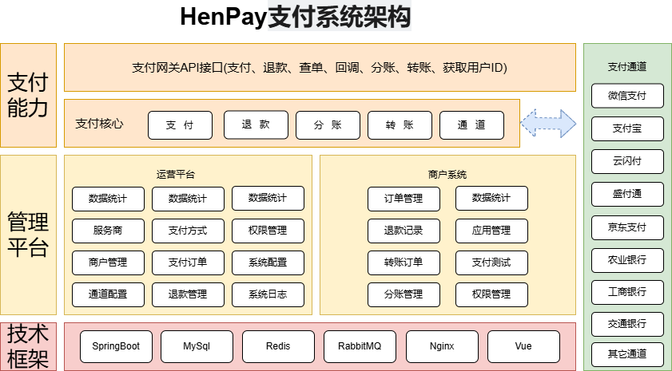

= HenPay

== 项目介绍

HenPay 是一套适合互联网企业使用的开源支付系统，支持多渠道服务商和普通商户模式。已对接微信支付，支付宝，云闪付官方接口，支持聚合码支付。

HenPay 使用 Spring Boot 和 Ant Design Vue 开发，集成 Spring Security 实现权限管理功能，是一套非常实用的 web 开发框架。

== 项目特点

* 支持多渠道对接，支付网关自动路由
* 已对接微信服务商和普通商户接口，支持 V2 和 V3 接口
* 已对接支付宝服务商和普通商户接口，支持 RSA 和 RSA2 签名
* 已对接云闪付服务商接口，可选择多家支付机构
* 提供 http 形式接口，提供各语言的 sdk 实现，方便对接
* 接口请求和响应数据采用签名机制，保证交易安全可靠
* 系统安全，支持分布式部署，高并发
* 管理端包括运营平台和商户系统
* 管理平台操作界面简洁、易用
* 支付平台到商户系统的订单通知使用 MQ 实现，保证了高可用，消息可达
* 支付渠道的接口参数配置界面自动化生成
* 使用 spring security 实现权限管理
* 前后端分离架构，方便二次开发

== 技术栈

- java 17
- SpringBoot 3
- Redis
- MySQL
- MQ(ActiveMQ 或 RabbitMQ 或 RocketMQ)
- Ant Design Vue
- MyBaits-Plus
- WxJava
- Hutool

== 系统架构

=== 定义与核心功能

在 HenPay 支付系统中，运营平台、服务商和商户是三个不同层级的角色，其核心区别如下：

[cols="2,4,4a"]
|===
|角色|定义|核心功能

|运营平台
|系统管理中枢，由平台方或技术团队直接控制
|
- 全局配置支付通道、费率规则等参数
- 管理所有服务商和商户账号
- 监控交易数据与风险

|服务商
|支付生态的构建者，多为具备支付资质的机构（如微信/支付宝服务商）
|
- 协助商户完成支付渠道入驻（特约商户模式）
- 发展代理商或下级商户
- 配置分润规则与设备管理

|商户
|直接提供商品/服务的终端商家
|
- 发起支付请求（如收款、退款）
- 管理订单与分账
- 配置自有支付参数
|===

=== 权限差异

==== 运营平台

* 最高权限：可修改系统级配置（如支付渠道接口参数、全局费率模板）
* 数据访问：查看全平台交易流水、服务商分润明细
* 安全控制：设定服务商/商户的操作权限范围（如是否允许自定义费率）

==== 服务商

* 业务扩展：发展代理商或商户，并通过分润获取收益
* 通道管理：为下属商户配置支付接口（如微信V3、支付宝直连）
* 设备绑定：分配云喇叭、扫码POS等硬件设备给商户

==== 商户

* 支付操作：仅限于自身账户下的订单管理（如发起退款、查询分账状态）
* 参数限制：费率、支付方式等参数需遵循服务商或平台规则

=== 适用场景对比

[cols="1,3,3,3"]
|===
|场景|运营平台|服务商|商户

|支付接口对接
|负责与微信/支付宝等渠道的官方对接
|使用平台提供的接口发展商户
|通过服务商或平台接口发起支付请求

|费率配置
|设定全局基准费率
|在平台规则内调整下级商户费率
|仅能查看自身费率，不可修改

|硬件管理
|制定设备接入标准
|向商户分配云喇叭、扫码POS等设备
|使用服务商分配的硬件完成收款

|数据可见性
|全平台数据统计与分析
|查看自身及下属商户的交易数据
|仅限本商户订单记录
|===

== 初始账号

系统部署后初始账号密码。

运营平台

账号：jeepay
密码：jeepay123

商户系统

账号在运营平台创建 test123456, 默认密码：jeepay666

登录商户系统后可测试支付下单流程。
